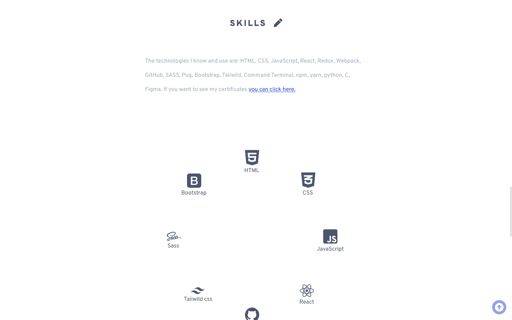

# My-portfolio
My portfolio, a simple application, where you can change themes and it has 2 languages, you can use the design or improve it, it was developed with React. 
## Development 
### Project structure
The structure of the app is simple, most of the features (language, themes, dark theme) of the app are handled with the useContext hook, inside the `components` folder there is a `styles` folder in this folder there are all styles CSS.

### My experience developing

The web application allows to select colors, when the user selects a color, the entire application will change. Includes a button to change the dark theme.The development caused me a lot of trouble as I was very new to React and functional programming, but it helped me understand much more deeply how states work in React. Also use React's useContext hook, this for the app's theme and language.

This app helped me a lot, and I will reuse a lot of code, like modals, or maybe guide me on the code I wrote.

### Technologies used in the project

1. [React](https://es.reactjs.org/)
1. [styled-components](https://styled-components.com/)
1. [Vite](https://vitejs.dev/)

## Demo 

💻 You can copy the link and paste it in your browser: https://yerikah.github.io/briefcase/

🔗 I was also able to open the website by [clicking here.](https://yerikah.github.io/briefcase/)

### Screenshots

## Author

- Harvey Yerik

    - [Twitter](https://twitter.com/yerikhar)
    - [GitHub](https://github.com/YerikAH)
    - [Send Me A Message](https://yerikah.github.io/send-me-a-message/dist/)

